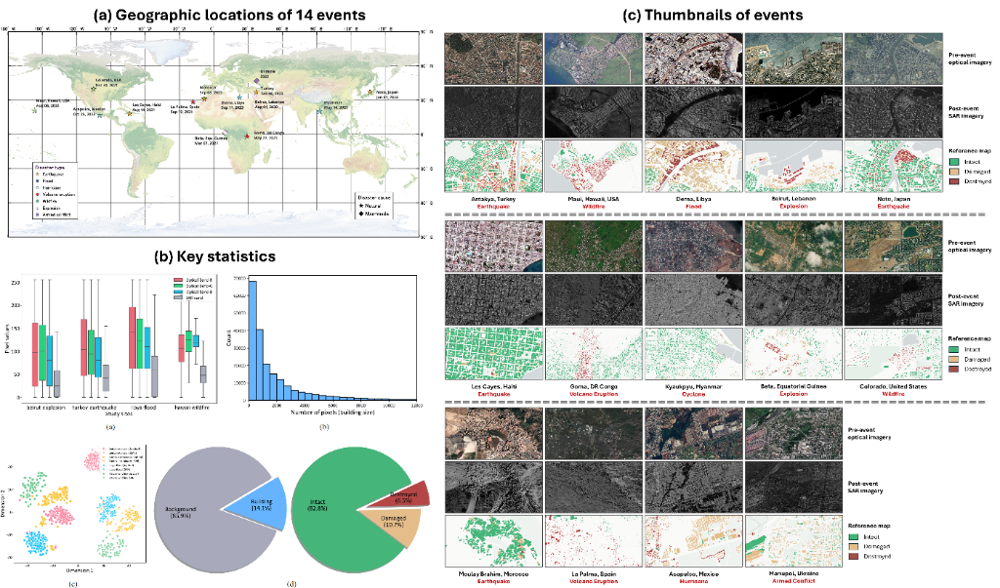
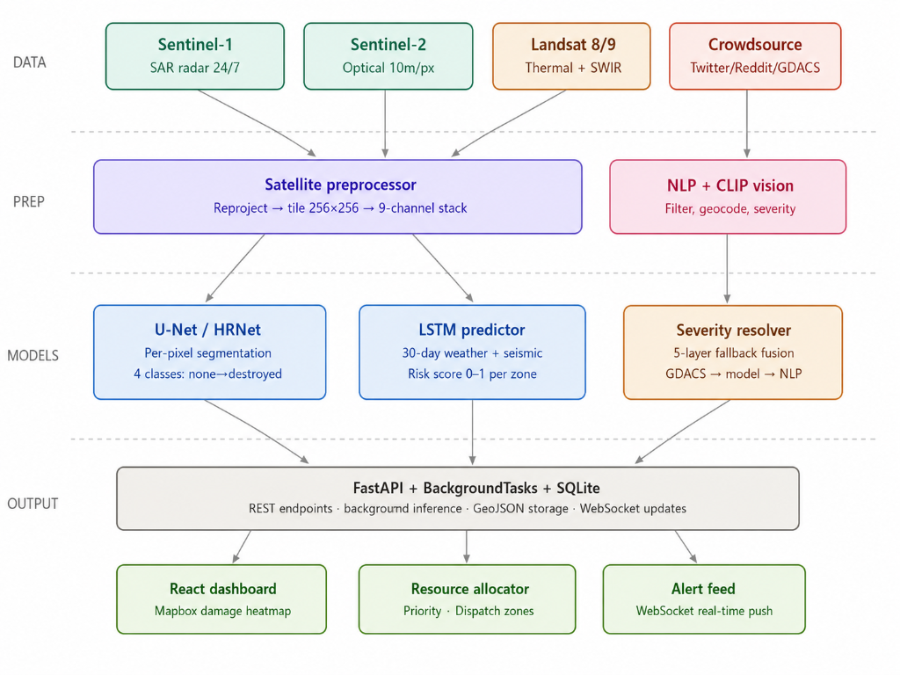
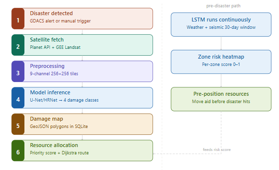
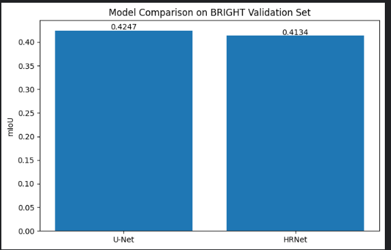
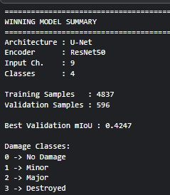
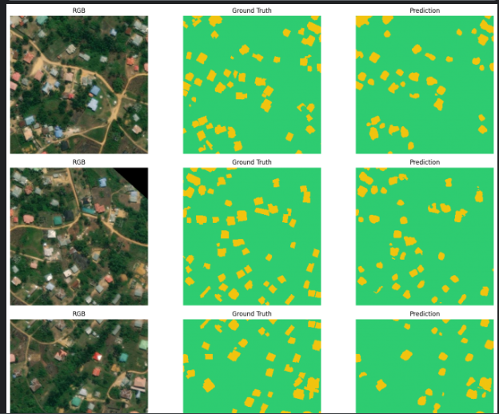
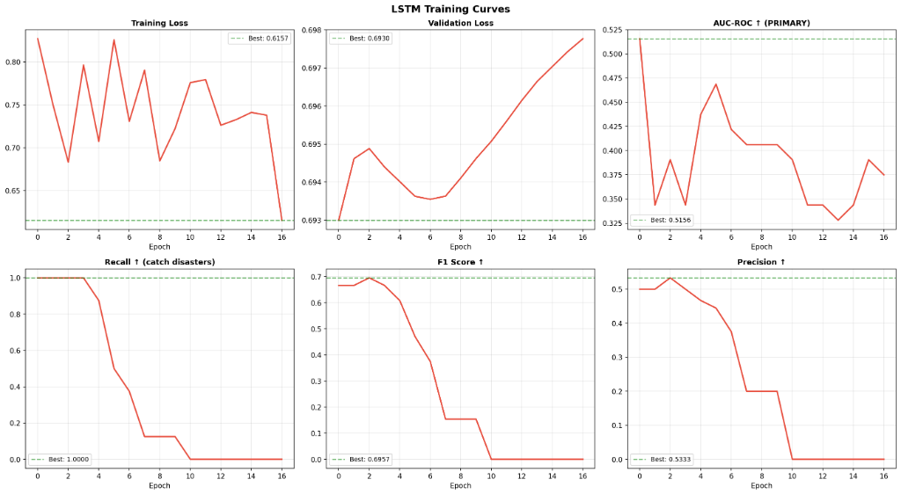
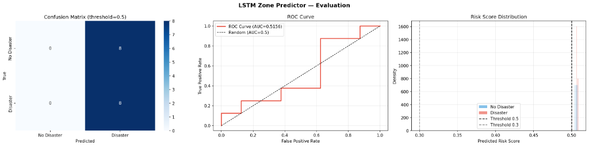
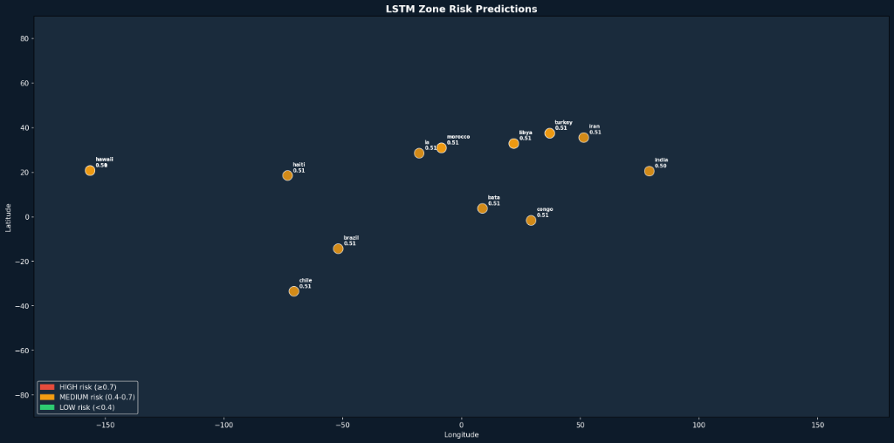

# DisasterAI  Smart Disaster Management System

## 1. Project Description

DisasterAI is an end-to-end AI system built to solve a real coordination failure in disaster response — the gap between a disaster happening and authorities knowing where to send help. Traditional response relies on manual surveys and phone reports which are too slow. This system  classifies building and area damage from satellite imagery  of an event, and generates optimal resource deployment routes automatically.

The project operates in two modes simultaneously-
:- Before or during a disaster, an LSTM model runs on historical weather and seismic data to produce a risk heatmap , authorities can pre-position resources to high-risk zones. 

:-After a disaster, real satellite images are fetched from Planet Insights Platform and Google Earth Engine, processed into a standardised 9-channel input (optical + SAR radar + spectral indices + coherence), and pushed through a trained U-Net or HRNet segmentation model that labels every pixel as no damage, minor, major, or destroyed. The results are rendered as live GeoJSON polygons on a Mapbox dashboard, and a resource allocation engine uses Dijkstra's algorithm with priority scoring to recommend exactly which rescue teams go where.


## 2. Data Description

The DisasterAI system utilizes separate dataset inputs for its two main models: the U-Net damage segmentation model (post-disaster satellite imagery) and the LSTM zone risk predictor (pre-disaster time-series data).

### A. U-Net Damage Segmentation (BRIGHT Dataset)

DisasterAI is trained and evaluated on **BRIGHT** (Building damage classification and change detection dataset in multimodal satellite Imagery). 

BRIGHT is the first open-access, globally distributed, event-diverse multimodal dataset specifically curated to support AI-based disaster response. It covers five types of natural disasters and two types of man-made disasters across 14 disaster events in 23 regions worldwide, with a particular focus on developing countries.

It supports not only the development of supervised deep models, but also the testing of their performance on cross-event transfer setup, as well as unsupervised domain adaptation, semi-supervised learning, unsupervised change detection, and unsupervised image matching methods in multimodal and disaster scenarios.



### B. LSTM Zone Risk Predictor (Pre-Disaster Time-Series)

This multi-modal time-series data is used to predict localized disaster risk prior to or during an event. It integrates weather signals, seismic tremors, and ground truth disaster records:

#### 1. Meteorological Data (Open-Meteo)
This dataset tracks the atmospheric conditions for each zone. Since disasters like floods and wildfires are heavily influenced by weather, we fetch a 60-day history leading up to the target date.
*   **Source:** [Open-Meteo API](https://open-meteo.com/)
*   **Key Features:**
    *   **Temperature (`temp_max`, `temp_min`, `temp_mean`):** Used to detect heatwaves (wildfire risk) or extreme cold.
    *   **Precipitation (`precipitation`):** Crucial for flood prediction and soil saturation analysis.
    *   **Wind Speed (`windspeed_max`):** Helps identify storm conditions or wildfire spread potential.
    *   **Humidity (`humidity`):** High humidity often precedes floods, while low humidity is a precursor to wildfires.

#### 2. Seismic Data (USGS)
This dataset monitors the movement of the Earth's crust. It is vital for predicting earthquakes and volcanic eruptions.
*   **Source:** [USGS Earthquake API](https://earthquake.usgs.gov/)
*   **Search Parameters:** We query every event with a magnitude > 1.0 within a 300km radius of each zone's coordinates.
*   **Key Features:**
    *   **`quake_count`:** The frequency of tremors (increased activity often precedes larger events).
    *   **`max_magnitude`:** The strongest quake recorded that day.
    *   **`total_energy`:** Calculated using the proxy $10^{1.5 \times \text{magnitude}}$, which represents the actual physical energy released, rather than just the logarithmic scale value.
    *   **`depth_mean`:** Shorter-depth quakes typically cause more surface damage and can indicate different types of tectonic stress.

#### 3. Historical Disaster Records (GDACS)
While the first two datasets are 'signals', this dataset provides the 'ground truth' labels for historical events.
*   **Source:** [GDACS API](https://www.gdacs.org/)
*   **Data Types:** Covers Earthquakes (EQ), Floods (FL), Tropical Cyclones (TC), Volcanoes (VO), and Wildfires (WF).
*   **Role in Model:** We use this to identify exactly when and where disasters occurred. We then label the 30-day window before these events as Positive (1) and windows where no disaster occurred as Negative (0). This allows the LSTM to learn the 'signature' patterns that lead up to a catastrophe.

Together, these create a multi-modal time series that looks for correlations—like a combination of specific seismic energy patterns and high precipitation—that might signal a localized risk.

---

## 3. Architecture 

Three layers stacked on top of each other:

*   **Data Layer** — three satellite sources cover each other's blind spots-
  1)  Sentinel-2 provides colour optical imagery but fails in clouds and at night. 
  2)  Sentinel-1 SAR radar works 24/7 in any weather but shows change not colour.
  3) Landsat provides thermal data for fire detection. Together they produce a 9-channel input per tile. 
  4) A fourth stream collects crowdsource social media posts and filters them via NLP and CLIP vision to extract verified severity signals.
*   **AI/ML Layer** — U-Net (ResNet50 encoder) and HRNet (W32) both solve the same task — per-pixel damage classification. The LSTM zone predictor operates on time-series weather and seismic data to predict risk before satellite images even exist. A 5-layer severity resolver fuses satellite model output, GDACS alerts, CLIP image analysis, and NLP keywords to produce a single authoritative severity score.
*   **Decision Layer** — FastAPI serves all model outputs via REST, WebSocket, and Server-Sent Events (SSE). A resource allocation engine takes the damage map, road network, available resources, and population density and produces a ranked deployment list with routes. The React dashboard renders everything on a live Mapbox map.



---

## 4. How It Works 

Two parallel pipelines run:

*   **Pre-disaster (LSTM path):** The LSTM processes 30-day sequences of 22 features per zone and outputs a risk score 0–1. Zones above 0.7 are flagged on the dashboard as HIGH risk so emergency authorities can pre-position resources.
*   **Post-disaster (U-Net path):** When a disaster event is detected (GDACS alert or manual trigger), the system fetches before and after satellite images for the bounding box. The preprocessor aligns images to the same coordinate system, tiles them into 256×256 patches with 32px overlap, and stacks them into 9-channel tensors. The trained segmentation model classifies each tile in the background using FastAPI **BackgroundTasks**. Tiles are stitched back into a full damage map and converted to GeoJSON polygons stored in **SQLite**. The resource allocator scores each damaged zone by severity × population × road accessibility × time urgency, sorts them, assigns nearest available resources, and finds the optimal route using Dijkstra on the OpenStreetMap road graph.

      

---

## 5. Summary:

| Function | Detail |
|---|---|
| **Pre-disaster risk prediction** | LSTM flags high-risk zones hours or days before an event using weather and seismic signals |
| **Satellite damage classification** | U-Net labels every pixel in post-disaster satellite imagery as one of 4 damage levels |
| **Multimodal fusion** | Combines SAR radar + optical + thermal so the system works at night and through cloud cover |
| **Social media signal extraction** | Filters and geocodes crowdsource posts, extracts visual severity from attached images using CLIP |
| **Severity resolution** | Merges 5 data sources into one authoritative severity score per zone |
| **Resource allocation** | Ranks zones by priority and finds optimal rescue routes on the live road network |
| **Live dashboard** | Mapbox map with WebSocket-pushed damage zone overlays, real-time alert feed, deployment controls |

---

## 6. Simplified Production Stack


| Layer | Technology |
|---|---|
| **Satellite data** | Planet Insights Platform (Sentinel-1/2), Google Earth Engine (Landsat 8/9) |
| **Deep learning** | pytorch , Unet Vs Hrnet , LSTM |
| **Model serving** | PyTorch & ONNX Runtime (fast local CPU/GPU inference) |
| **Image processing** | Rasterio, GDAL, Albumentation|
| **Backend** | FastAPI (with native async **BackgroundTasks** replacing Celery/Redis) |
| **Database** | SQLite (zero-setup single-file database replacing PostgreSQL/PostGIS) |
| **ORM** | SQLAlchemy (tables auto-created on startup, replacing Alembic) |
| **Routing algorithm** | NetworkX (Dijkstra on OSM road graph) |
| **Frontend** | React, Vite, Mapbox GL JS, Recharts, Zustand, Axios |
| **Real-time** | WebSocket & Server-Sent Events (SSE) for live inference progress streaming |
| **Containerisation** | Docker, Docker Compose (exactly 2 services: `api`, `frontend`) |

---

## 7. Repository Structure

```
disaster-ai-system/
│
├── src/
│   ├── data_pipeline/
│   │   ├── satellite_fetcher.py      # Planet API + Sentinel fetch
│   │   ├── landsat_fetcher.py        # GEE Landsat fetch
│   │   ├── crowdsource_fetcher.py    # Twitter, Reddit, GDACS
│   │   ├── nlp_filter.py             # Text cleaning, NER, geocoding
│   │   ├── social_image_analyzer.py  # CLIP + OCR on social images
│   │   ├── severity_resolver.py      # 5-layer severity fusion
│   │   ├── preprocessor.py           # 9-channel tile builder
│   │   ├── index_calculator.py       # NDVI, NDWI, NBR, coherence
│   │   └── dataset_builder.py        # PyTorch Dataset + DataLoader
│   │
│   ├── models/
│   │   ├── unet.py                   # U-Net damage segmentation
│   │   ├── hrnet.py                  # HRNet damage segmentation
│   │   ├── fusion_model.py           # SAR + optical fusion
│   │   ├── zone_predictor.py         # LSTM zone risk model
│   │   └── resource_allocator.py     # Priority scoring + Dijkstra
│   │
│   ├── training/
│   │   ├── augmentation.py           # Satellite-specific augmentation
│   │   ├── losses.py                 # Dice + CrossEntropy combined
│   │   ├── metrics.py                # IoU, F1, pixel accuracy
│   │   ├── train_damage.py           # U-Net training loop
│   │   ├── train_zone.py             # LSTM training loop
│   │   └── evaluate.py               # Test set evaluation + reports
│   │
│   ├── api/
│   │   ├── main.py                   # FastAPI app + model load at startup
│   │   ├── schemas.py                # Pydantic request/response models
│   │   └── routes/
│   │       ├── disasters.py          # Disaster event endpoints
│   │       ├── resources.py          # Resource allocation endpoints
│   │       └── predict.py            # Inference trigger + SSE stream status
│   │
│   └── database/
│       ├── models.py                 # SQLAlchemy ORM tables
│       └── connection.py             # SQLite Session factory + get_db()
│
├── frontend/
│   ├── Dockerfile.simple             # Vite Static serve container
│   └── src/
│       ├── pages/Dashboard.jsx       # Main dashboard page
│       ├── components/
│       │   ├── DisasterMap.jsx       # Mapbox damage overlay
│       │   ├── MetricsPanel.jsx      # Stats + Recharts
│       │   ├── AlertFeed.jsx         # Real-time WebSocket feed
│       │   └── ResourcePanel.jsx     # Deployment controls
│       └── services/
│           ├── api.js                # All Axios calls
│           └── websocket.js          # WebSocket + auto-reconnect
│
├── models/checkpoints/               # Place active_model.pth here
├── data/
│   ├── datasets/BRIGHT/              # Raw training dataset
│   └── processed/BRIGHT/             # Preprocessed 256×256 tiles
│
├── notebooks/
│   ├── DisasterAI_Training.ipynb     # U-Net + HRNet Colab notebook
│   └── DisasterAI_LSTM_Training.ipynb# LSTM Colab notebook
│
├── scripts/export_onnx.py            # PyTorch → ONNX export
├── configs/config.yaml               # Central tunable config settings
├── Dockerfile                        # Backend FastAPI container
│   └── docker-compose.yml                # Main 2 services
```

---

## 8. Run Locally

**Prerequisites:** Docker Desktop or standard Python 3.10+.

### Option A: Using Docker Compose (Recommended)

```bash
# 1. Clone the repo
git clone https://github.com/your-username/disaster-ai-system.git
cd disaster-ai-system

# 2. Copy the environment template and fill in your credentials
cp .env.example .env
# Open .env and add:
#   SENTINELHUB_CLIENT_ID=       (from Planet)
#   SENTINELHUB_CLIENT_SECRET=
#   GEE_SERVICE_ACCOUNT_KEY=     (path to GEE JSON key file)
#   TWITTER_BEARER_TOKEN=

# 3. Place your trained model checkpoint
mkdir -p models/checkpoints
cp /path/to/UNet_ResNet50_best.pth models/checkpoints/active_model.pth

# 4. Start the 2 services (API + Frontend)
docker-compose up --build
```

### Option B: Running Locally (Without Docker)

```bash
# 1. Create and activate virtual environment
python -m venv dms
dms\Scripts\activate  # On Windows
source dms/bin/activate  # On macOS/Linux

# 2. Install requirements
pip install -r requirements.txt

# 3. Start the FastAPI backend
uvicorn src.api.main:app --reload --port 8000

# 4. Start the React frontend (separate terminal)
cd frontend
npm install
npm run dev
```


## 9. Triggering Inference

To trigger a full damage assessment run:

1. **Create an Event** via REST API:
   ```bash
   curl -X POST http://localhost:8000/api/disasters/ \
     -H "Content-Type: application/json" \
     -d '{"event_type":"earthquake","name":"Turkey Earthquake","magnitude":7.8}'
   ```
2. **Trigger Inference**:
   ```bash
   curl -X POST http://localhost:8000/api/predict/ \
     -H "Content-Type: application/json" \
     -d '{"event_id":1,"optical_path":"data/raw/sentinel2_after.tif"}'
   ```

The dashboard will load and display damage zones in real time as the background thread tiles and segments the images.

---

## 10. Final Model Comparison

Below are the training curves, evaluation metrics, and performance summaries for both the U-Net Damage Segmentation model (satellite imagery) and the LSTM Zone Risk Predictor (time-series).

### A. U-Net & HRNet Damage Segmentation (BRIGHT Dataset)

#### Evaluation Summary

```
============================================================
FINAL MODEL COMPARISON
============================================================
Train Samples : 4837
Val Samples   : 596

Performance
U-Net  mIoU : 0.4247
HRNet  mIoU : 0.4134

Winner : U-Net
Improvement : 0.0113
```

#### Visual Performance & Comparisons

| Model Comparison on BRIGHT Validation Set | Winning Model Summary |
| :---: | :---: |
|  |  |

#### Sample Predictions (RGB vs. Ground Truth vs. Prediction)



---

### B. LSTM Zone Risk Predictor (Pre-Disaster Path)

#### Training Curves
Below are the training and validation curves showing training loss, validation loss, AUC-ROC, Recall, F1 Score, and Precision across training epochs.



#### Evaluation & Metrics
The evaluation panel displays the confusion matrix, ROC curve, and risk score distribution at threshold 0.5 and 0.3.



#### Zone Risk Predictions Map
A global map displaying the predicted risk scores for both historical disaster events and negative control zones (low/medium/high risk classification).


